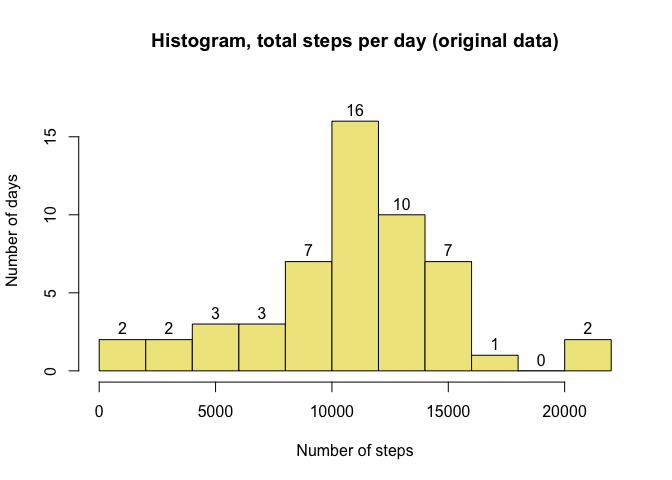
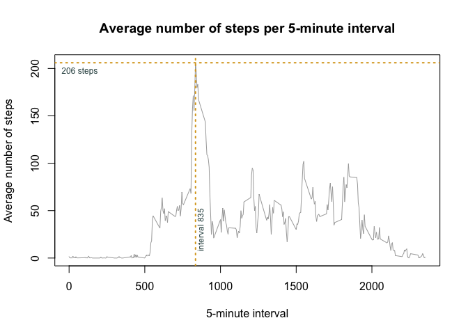
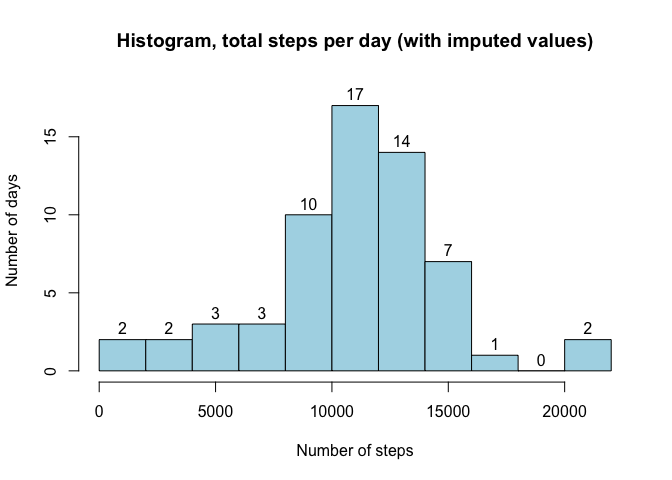
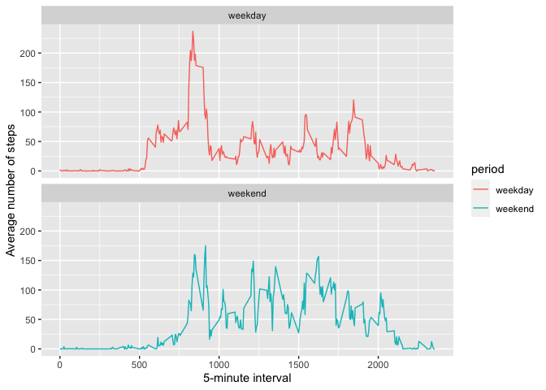

## Loading and preprocessing the data
Load required packages

```r
library(dplyr)
library(lubridate)
library(ggplot2)
```

Load the data into R (assumes the unzipped 'activity.csv' file is in the R working directory)
and convert the `date` field to a date format.

```r
data <- read.csv('activity.csv')
data$date <- ymd(data$date)
```


## What is mean total number of steps taken per day?

Group the data by `date` and calculate the total number of steps per day

```r
steps_per_day <- data %>%
        group_by(date) %>%
        summarise(total_steps = sum(steps))
```

Create histogram showing distribution of total steps per day

```r
hist(steps_per_day$total_steps,
     breaks=10,
     main="Histogram, total steps per day (original data)",
     col="khaki",
     xlab="Number of steps",
     ylab="Number of days",
     ylim=c(0,18),
     labels=TRUE)
```

<!-- -->

Show mean and median number of steps taken per day, rounded to nearest step

```r
round(summary(steps_per_day$total_steps)[c("Mean","Median")], 0)
```

```
##   Mean Median 
##  10766  10765
```


## What is the average daily activity pattern?

Group data and calculate mean steps per interval

```r
mean_by_interval <- data %>%
        group_by(interval) %>%
        summarize(mean_steps = mean(steps, na.rm=TRUE))
```

Find the interval with the most average steps and the corresponding value; save these for later use

```r
max_interval <- slice_max(mean_by_interval, mean_steps)$interval
max_value <- round(max(mean_by_interval$mean_steps), 0)
```

Plot data with reference lines to show the interval with the most average steps

```r
with(mean_by_interval, plot(interval, mean_steps, 
        type='l',
        col='darkgrey',
        main="Average number of steps per 5-minute interval",
        xlab="5-minute interval",
        ylab="Average number of steps"))

#add reference line and label for max_interval
abline(v=max_interval, col = "goldenrod", lty = 3, lwd=2)
text(x=max_interval+35, y=30, col="darkslategray", cex=0.75, srt=90, paste('interval', max_interval))

#add reference line and label for max_value
abline(h=max_value, col = "goldenrod", lty = 3, lwd=2)
text(x=70, y=max_value-9, col="darkslategray", cex=0.75, paste(max_value, 'steps'))
```

<!-- -->

Interval 835 has the greatest average number of step (206 steps).

## Imputing missing values

There are **2304 missing values** in the data. All appear in the `steps` variable.

To reduce the impact of NA values on the analysis we'll create a copy of the data, named `data_imputed`, that replaces NAs with imputed values. The imputed value will be the mean for the corresponding interval and weekday, rounded to the nearest step. For example, the NA for interval 800 of October 1, 2012 (a Monday) will be replaced with 25, the rounded mean of non-NA values for all other records where the interval is 800 and the weekday is Monday.


```r
data_imputed <- data %>%
        mutate(day_of_week = weekdays(date)) %>%
        group_by(day_of_week, interval) %>%
        mutate(steps = round(ifelse(is.na(steps), mean(steps, na.rm=TRUE), steps),0)) %>%
        ungroup() %>%
        select(-day_of_week)
```

To check the impact of imputing the NA values, here's a new histogram based on `data_imputed`

```r
steps_per_day_imputed <- data_imputed %>%
        group_by(date) %>%
        summarise(total_steps = sum(steps))

hist(steps_per_day_imputed$total_steps,
     breaks=10,
     main="Histogram, total steps per day (with imputed values)",
     col="lightblue",
     xlab="Number of steps",
     ylab="Number of days",
     ylim=c(0,18),
     labels=TRUE)
```

<!-- -->

Notice the following changes compared to the original histogram with NA values:

<div style="width: 60%; margin-left:5%">
| # of steps (range) | <span style="background-color: khaki; display: block"># of days<br/>(original data)</span> | <span style="background-color: lightblue; display: block"># of days<br/>(with imputed values)</span> |
| :--- | :---: | :---: |
| 8,000-9,999 | 7 | 10 | 
| 10,000-11,999 | 16 | 17 |
| 12,000-13,999 | 10 | 14 |
</div>

The imputed values also change the mean and median number of steps per day; here are the new calculations

```r
round(summary(steps_per_day_imputed$total_steps)[c("Mean","Median")], 0)
```

```
##   Mean Median 
##  10821  11015
```


## Are there differences in activity patterns between weekdays and weekends?

The first step is to add a factor variable to `data_imputed` that distinguishes between weekend and weekday entries, named `period`

```r
data_imputed$period = as.factor(ifelse(weekdays(data_imputed$date) %in% c("Saturday", "Sunday"), "weekend", "weekday"))
```

Next we group, summarize, and plot the data to illustrates differences by period

```r
by_period <- data_imputed %>%
        group_by(period, interval) %>%
        summarize(mean_steps = mean(steps))

ggplot(by_period, aes(interval, mean_steps, col=period)) +
        geom_line() +
        facet_wrap(vars(period), ncol=1) +
        labs(x="5-minute interval", y="Average number of steps")
```

<!-- -->
